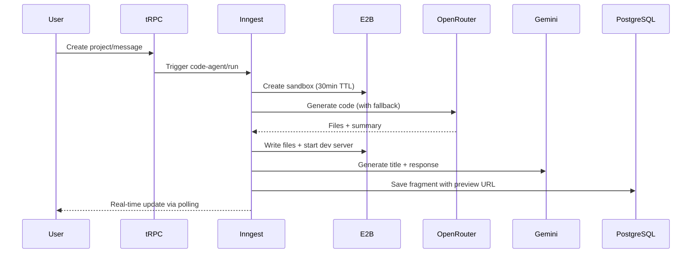

<div align="center">
  <h1>⚡ Zync</h1>
  <p><strong>AI-Powered Web App Builder — Describe it, Build it, Ship it.</strong></p>
  
  <a href="https://zync-ashen.vercel.app">Live Demo</a> •
  <a href="#-features">Features</a> •
  <a href="#-architecture">Architecture</a> •
  <a href="#-getting-started">Get Started</a>
  
  <br/><br/>
  
  
  
  
  
  
</div>

---

## 📸 Demo

> Transform natural language descriptions into fully functional React applications with live sandbox previews.

**Live:** [zync-ashen.vercel.app](https://zync-ashen.vercel.app)

---

## 🎯 Problem Statement

Developers often spend hours setting up boilerplate code for simple React applications. Non-developers struggle to prototype ideas without coding knowledge. **Zync bridges this gap** by letting anyone describe a web app in plain English and receive working code with a live preview in seconds.

---

## 🚀 Features

| Feature | Description |
|---------|-------------|
| **AI Code Generation** | Multi-model orchestration with intelligent fallback chain (Claude → Gemini → GPT) |
| **Live Sandbox Preview** | E2B-powered isolated execution environment with instant preview URLs |
| **Smart Rate Limiting** | Credit-based system with 30-day rolling window using Prisma-backed storage |
| **Conversation Memory** | Context-aware generation using last 4 messages for iterative refinement |
| **Import Validation** | Static analysis detects broken imports before execution |
| **Exponential Backoff** | Automatic retry with 429/rate-limit handling and model switching |

---

## 🏗 Architecture

```
┌─────────────────────────────────────────────────────────────────────┐
│                           CLIENT (Next.js 15)                        │
├─────────────────────────────────────────────────────────────────────┤
│  Landing Page  │  Dashboard  │  Project View  │  Live Preview       │
│    (Hero/FAQ)  │  (Projects) │   (Chat UI)    │   (iframe/E2B)      │
└────────────────┴─────────────┴────────────────┴─────────────────────┘
                                    │
                                    ▼
┌─────────────────────────────────────────────────────────────────────┐
│                          tRPC API Layer                              │
├─────────────────────────────────────────────────────────────────────┤
│  projects.create  │  messages.create  │  usage.status  │  auth      │
└───────────────────┴───────────────────┴────────────────┴────────────┘
                                    │
                    ┌───────────────┴───────────────┐
                    ▼                               ▼
┌───────────────────────────────┐   ┌─────────────────────────────────┐
│         PostgreSQL            │   │        Inngest (Background)      │
│  • Projects, Messages         │   │  • code-agent/run function       │
│  • Fragments (generated code) │   │  • Multi-model fallback          │
│  • Usage tracking             │   │  • E2B sandbox orchestration     │
└───────────────────────────────┘   └─────────────────────────────────┘
                                                    │
                                                    ▼
                                    ┌─────────────────────────────────┐
                                    │      E2B Code Interpreter        │
                                    │  • Isolated React environment    │
                                    │  • Vite dev server (port 5173)   │
                                    │  • 30-min sandbox timeout        │
                                    └─────────────────────────────────┘
```

### Module Structure (Feature-Based)

```
src/
├── app/                    # Next.js App Router
│   ├── (landing)/          # Public marketing pages
│   ├── dashboard/          # Authenticated dashboard
│   └── projects/[id]/      # Dynamic project views
├── modules/                # Domain-driven feature modules
│   ├── projects/           # Project CRUD + AI trigger
│   │   ├── server/         # tRPC procedures
│   │   └── ui/             # React components
│   ├── messages/           # Chat message handling
│   └── usage/              # Credit tracking
├── inngest/                # Background job processing
│   ├── functions.ts        # Code generation workflow (523 LOC)
│   └── utils.ts            # Sandbox helpers
├── trpc/                   # End-to-end type-safe API
└── lib/                    # Shared utilities
```

---

## 🛠 Tech Stack

| Layer | Technology | Why |
|-------|------------|-----|
| **Framework** | Next.js 15 (App Router) | Server components, streaming, edge-ready |
| **Language** | TypeScript 5 | Type safety across full stack |
| **API** | tRPC v11 | End-to-end type safety, no codegen |
| **Database** | PostgreSQL + Prisma | Type-safe ORM with migrations |
| **Auth** | Clerk | Production-ready auth with minimal setup |
| **AI Models** | OpenRouter (Claude/Gemini/GPT) | Multi-provider access, fallback support |
| **Sandbox** | E2B Code Interpreter | Secure isolated code execution |
| **Background Jobs** | Inngest | Reliable function execution with retries |
| **UI** | Radix + Tailwind + Framer Motion | Accessible, beautiful, animated |

---

## 🤖 AI Generation Engine

The core of Zync is the `code-agent/run` Inngest function — a 500+ line orchestration system that:

### Model Fallback Chain

```
Claude 3.5 Sonnet → Gemini 2.0 Flash → GPT-4o Mini → Free Models
         ↓                 ↓                ↓
    (rate limited?)   (rate limited?)   (success!)
```

1. Tries models in priority order from `models[]` payload or `MODEL_CANDIDATES` env
2. Retries each model `N` times with exponential backoff (500ms → 1s → 2s → 4s cap)
3. **Fast-switches** on 429/rate-limit errors (no wasted retries)
4. Handles OpenRouter data-policy blocks gracefully

### Import Safety System

Before executing generated code, the engine:
- Scans all `.ts/.tsx/.js/.jsx` files for imports
- Validates relative imports resolve to created files
- Warns on `@/` alias usage without config
- Flags problematic npm packages (axios, react-router, etc.)

### Sandbox Lifecycle



---

## 📊 Performance

### Lighthouse Scores (Desktop)

| Metric | Score | Value |
|--------|-------|-------|
| **First Contentful Paint** | 99 | 0.6s |
| **Largest Contentful Paint** | 84 | 1.4s |
| **Cumulative Layout Shift** | 100 | ~0 |
| **Total Blocking Time** | - | 4.3s* |

*TBT is high due to Three.js 3D background on landing page — core app pages are fast.

### Load Testing (Autocannon)

```bash
# Health endpoint benchmark (Vercel serverless, 20 concurrent connections)
npm run bench:health:prod

# Results across 4 test runs:
┌─────────────────┬─────────────────────────────────────┐
│ Metric          │ Value                               │
├─────────────────┼─────────────────────────────────────┤
│ Avg Latency     │ 265ms (p99: 462ms)                  │
│ Throughput      │ 75 req/sec                          │
│ Total Requests  │ ~1000 requests in 15s               │
│ Consistency     │ Stdev 28-34ms (stable response)     │
└─────────────────┴─────────────────────────────────────┘
```

> **Note**: Latency includes Vercel cold starts and network round-trip from India to US-East. Local benchmarks show ~5ms latency.

---

## 🔐 Security

- **CSP Headers**: Strict frame-src allowing only E2B and Inngest
- **X-Frame-Options**: DENY (prevents clickjacking)
- **Clerk Auth**: Session-based authentication with middleware protection
- **tRPC Protected Procedures**: User isolation at API level
- **Sandbox Isolation**: E2B containers are ephemeral and isolated

---

## 🚀 Getting Started

### Prerequisites

- Node.js 18+
- PostgreSQL database (local or Neon/Supabase)
- API keys for: Clerk, E2B, OpenRouter, Inngest

### Quick Start

```bash
# Clone and install
git clone https://github.com/Rewant-1/zync.git
cd zync
npm install

# Setup environment
cp .env.example .env
# Fill in your API keys

# Database setup
npx prisma migrate dev
npx prisma generate

# Start development
npm run dev
```

### Environment Variables

```env
# Database
DATABASE_URL="postgresql://..."

# Auth (Clerk)
NEXT_PUBLIC_CLERK_PUBLISHABLE_KEY="pk_..."
CLERK_SECRET_KEY="sk_..."

# AI (OpenRouter)
OPENROUTER_API_KEY="sk-or-..."
MODEL_CANDIDATES="anthropic/claude-3.5-sonnet,google/gemini-2.0-flash"

# Sandbox (E2B)
E2B_API_KEY="e2b_..."

# Background Jobs (Inngest)
INNGEST_EVENT_KEY="..."
INNGEST_SIGNING_KEY="..."
```

---

## 📜 Scripts

| Command | Description |
|---------|-------------|
| `npm run dev` | Start development server |
| `npm run build` | Production build |
| `npm run lint` | ESLint check |
| `npm run bench:health` | Load test health endpoint (local) |
| `npm run bench:health:prod` | Load test health endpoint (production) |
| `npm run lighthouse:desktop` | Generate Lighthouse report |

---

## 📁 Key Files

| File | Purpose |
|------|---------|
| [src/inngest/functions.ts](src/inngest/functions.ts) | Core AI generation engine (523 LOC) |
| [src/prompts.ts](src/prompts.ts) | System prompts for code generation |
| [src/lib/usage.ts](src/lib/usage.ts) | Credit-based rate limiting |
| [src/trpc/init.ts](src/trpc/init.ts) | tRPC setup with auth middleware |
| [src/middleware.ts](src/middleware.ts) | Route protection with Clerk |
| [prisma/schema.prisma](prisma/schema.prisma) | Database models |

---

## 🗺 Roadmap

- [ ] Pro subscription with Stripe
- [ ] Export generated code as ZIP
- [ ] GitHub integration (push to repo)
- [ ] Template library
- [ ] Collaborative editing

---

## 🙏 Acknowledgments

- [Next.js](https://nextjs.org) — React framework
- [tRPC](https://trpc.io) — Type-safe APIs
- [Prisma](https://prisma.io) — Database toolkit
- [Clerk](https://clerk.com) — Authentication
- [E2B](https://e2b.dev) — Code sandboxing
- [Inngest](https://inngest.com) — Background jobs
- [OpenRouter](https://openrouter.ai) — AI model access
- [Radix UI](https://radix-ui.com) — Accessible components

---

<div align="center">
  <strong>Built with ❤️ by <a href="https://github.com/Rewant-1">Rewant</a></strong>
  <br/>
  <sub>If you found this useful, give it a ⭐!</sub>
</div>
